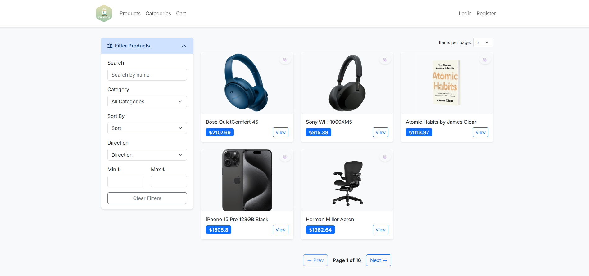
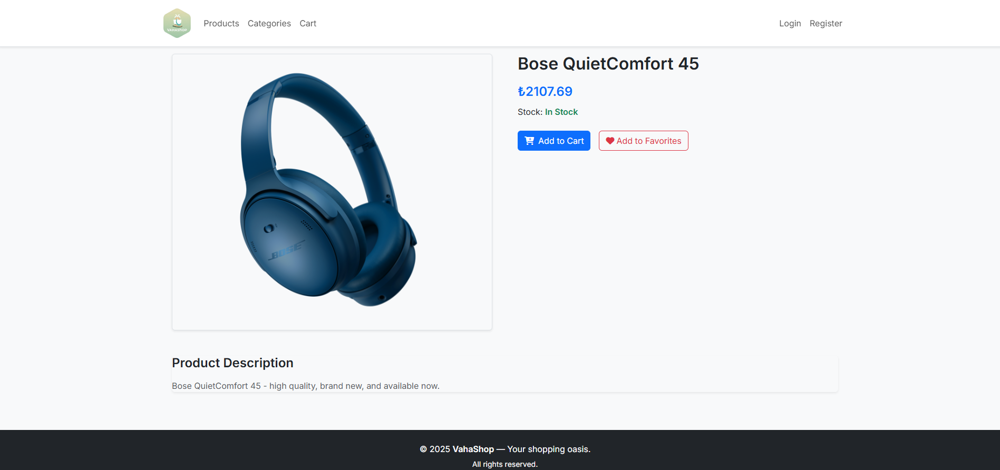
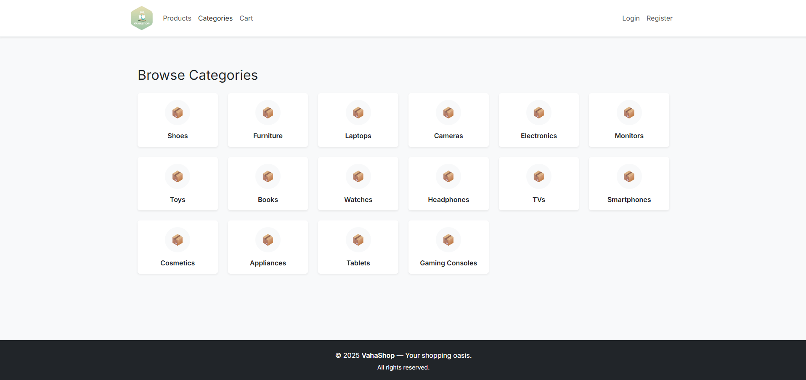
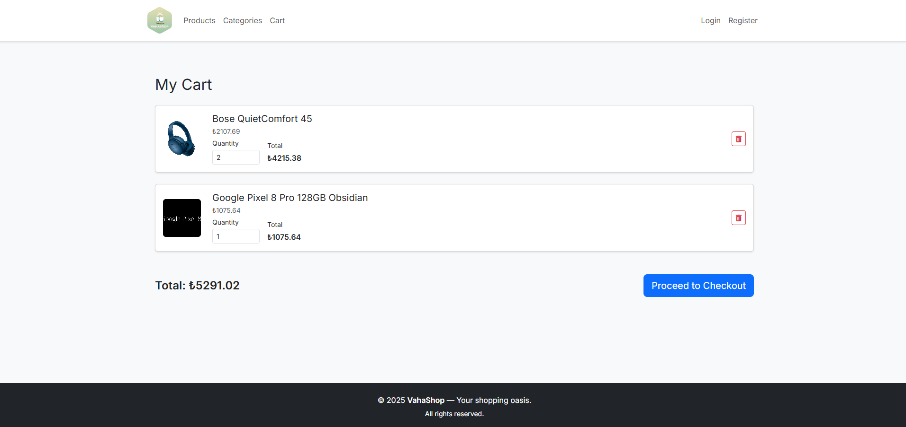
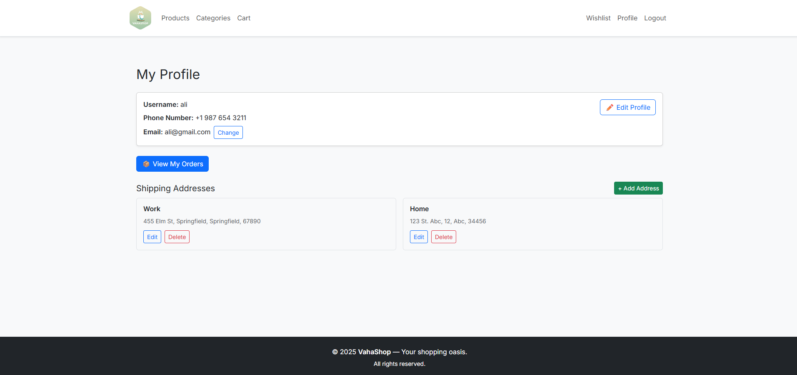
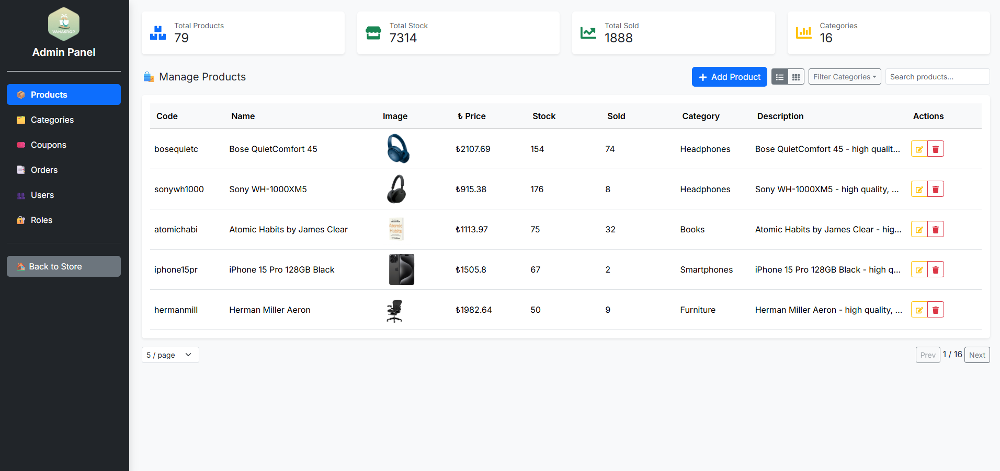
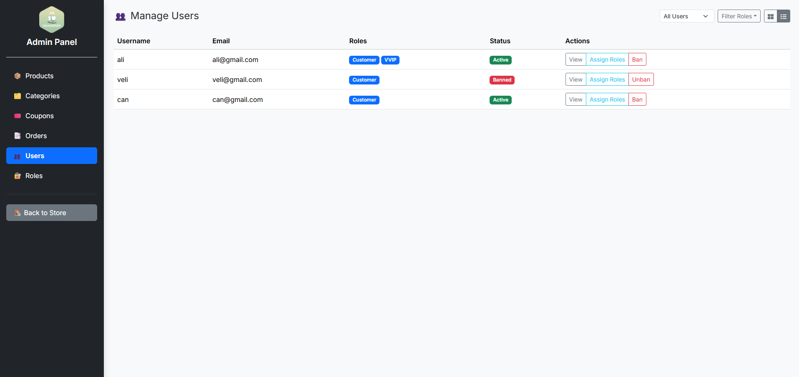

# 🛒 React E-Commerce Platform (VahaShop)

This is a full-featured e-commerce platform built with **React**, **Bootstrap 5**, and **Vite**. It includes both user-facing pages (product listings, cart, checkout) and admin features (product management, order tracking, etc).

> ⚠️ **Note**: This project requires a backend API to function. You can find the API repository here: [ecommerce-api](https://github.com/m-akgul/ecommerce-api)

---

## 🚀 Features

### 🌐 Public

- Product catalog with search, filters, sorting, and pagination
- Category browsing and price filtering
- Product detail page with image, price, description
- Add to cart (guest or authenticated users)
- Wishlist with persistent favorites
- Checkout with address selection and coupon support

### 👤 User

- Register/Login (JWT-based auth)
- Login with Google
- Profile management (email, phone, password change)
- Address book (CRUD)
- Orders list with order details and invoice download
- Wishlist management

### 🛠️ Admin

- Dashboard-like tiles with totals
- Product management (CRUD) with image, category, stock, price
- Toggle grid/table view
- Category management (CRUD)
- Coupon management (CRUD)
- Order list with status change and order details
- User management: roles, ban/unban, role filters
- Role management (CRUD)

### 💡 Extra Features

- Rate limiting and throttling via backend integration
- Session expiration detection and auto-logout
- Responsive navigation and layout
- Dialog and toast-based alert/confirmation feedback

---

## 🏗️ Tech Stack

- **Frontend**: ReactJS + Vite
- **State Management**: Context API (Auth, Cart, Dialogs, Favorites)
- **Validation**: React Hook Form + Yup
- **Styling**: Bootstrap 5
- **HTTP Client**: Axios (with interceptors and safe wrapper)
- **Persistence**: LocalStorage for guests

---

## 📁 Folder Structure

```
src/
  api/                # Axios config and wrapper
  components/         # Shared UI components
    admin/            # Admin-specific modals and forms
    common/           # Footer, ProductCard
    user/             # Profile-related modals
  contexts/           # Context providers (Auth, Cart, etc.)
  layouts/            # Admin and public layout wrappers
  pages/              # Main pages (Products, Cart, Admin, etc.)
  routes/             # Protected route wrappers
  utils/              # Helpers like constants, token utilities
```

---

## 🧪 Environment Setup

1. Clone the repo:

   ```bash
   git clone https://github.com/m-akgul/ecommerce-reactjs.git
   cd ecommerce-reactjs
   ```

2. Install dependencies:

   ```bash
   npm install
   ```

3. Start the dev server:

   ```bash
   npm run dev
   ```

> ⚠️ This project requires a backend API to function correctly (not included). Ensure endpoints under `/utils/constants.js` match your backend configuration.

---

## 🖼️ Screenshots

### Products Page



### Product Detail Page



### Categories Page



### Cart Page



### Profile Page



### Admin Panel



### Admin User Management


